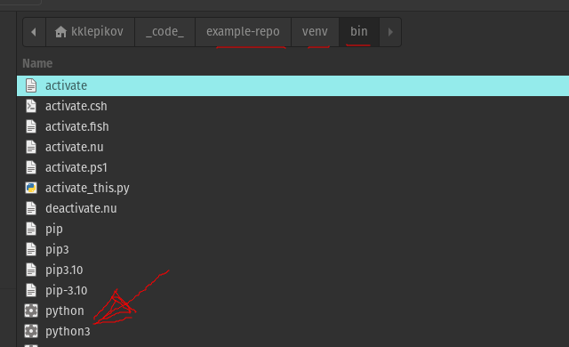
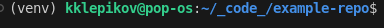

# example-repo

## How add local python

1. `virtualenv -p python3 venv`
2. then you can see folder `venv` in a root of project
3. switch python interpretator -> F1 -> выбрать интерпретатор ->

4. open new terminal

5. exclude folder `venv` from git tracking -> in a `.gitignore`
